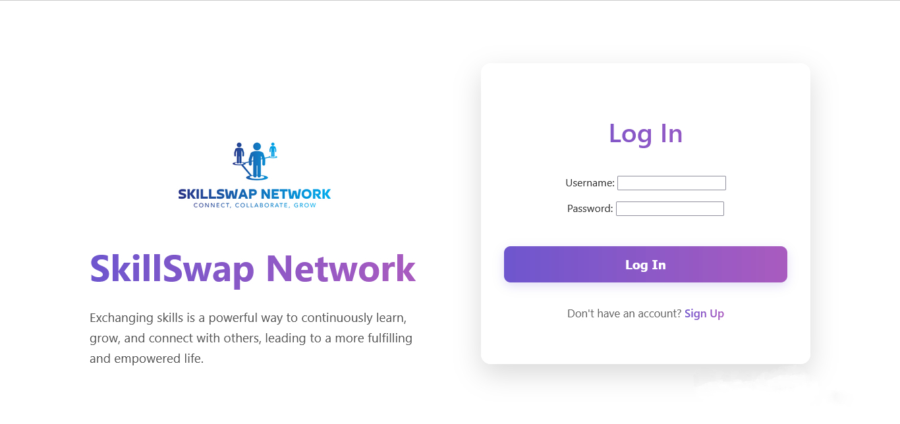
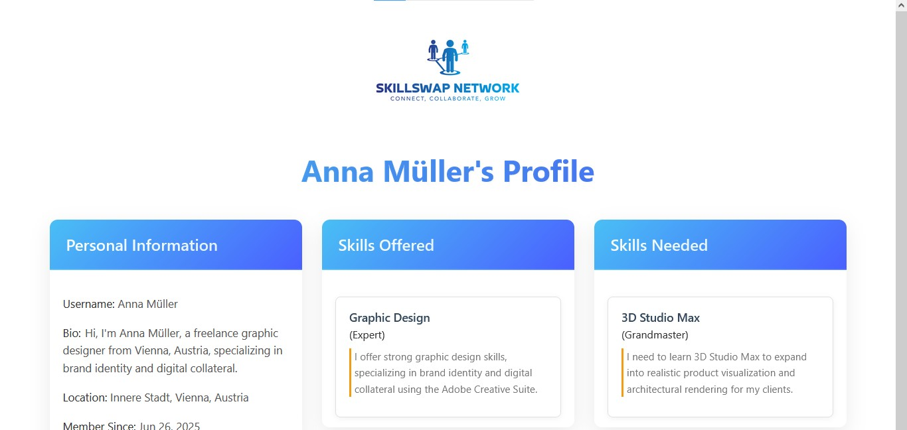
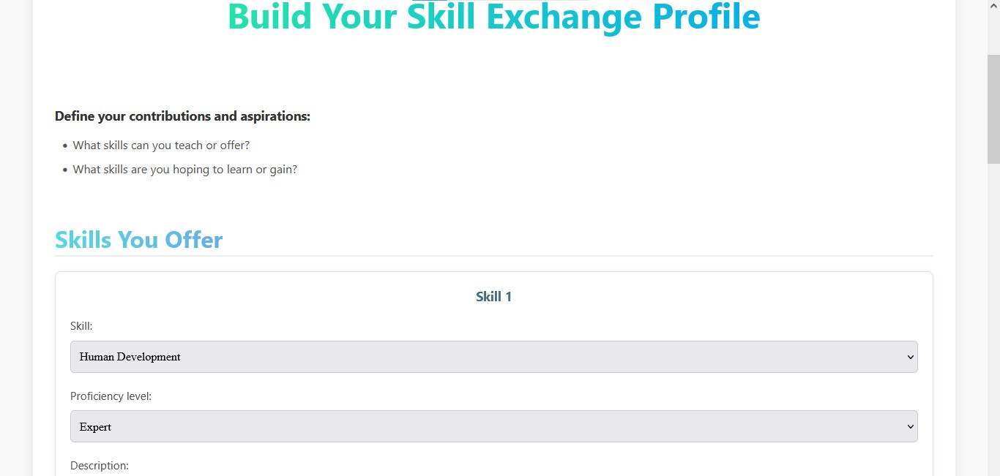
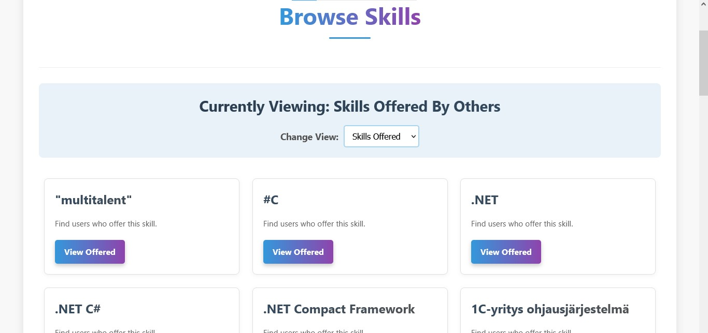
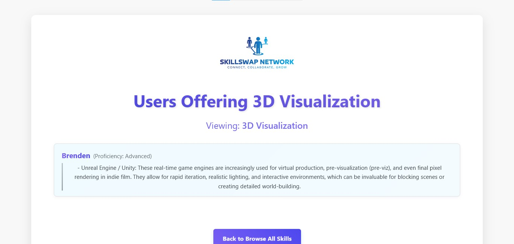
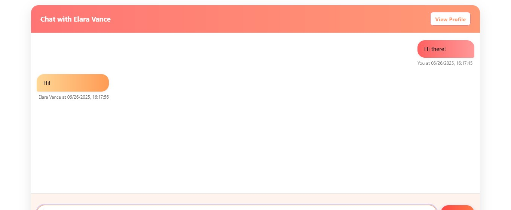
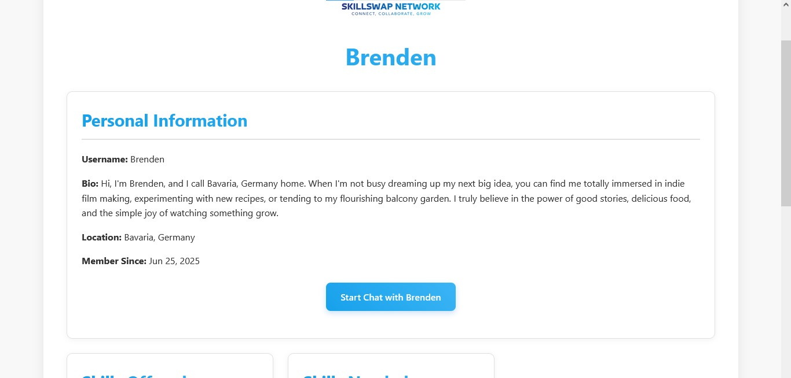

# SkillSwap Network: Exchange. Empower. Evolve.


## The Foundation

### Core Value Proposition

* A platform dedicated to fostering a community where users can seamlessly exchange knowledge, offer their expertise, and acquire new skills through real time interaction.

* It solves the problem of effectively connecting individuals for direct skill exchange and collaborative learning within a centralized community.

### The Vision Behind SkillSwap Network

* SkillSwap Network is a dynamic web application designed to connect individuals eager to share their knowledge and those looking to learn new skills.
  
* It addresses the need for accessible skill development and community-driven learning by providing a centralized platform where users can offer their proficiencies, find others who need those skills, and initiate real time chat conversations to facilitate the exchange.
  
* The platform empowers users to expand their personal and professional capabilities by leveraging the collective expertise of the community.
  

### Key Features at a Glance

1. **User Authentication:** Secure user registration, login and logout functionalities.

    
    <br>
    <br>
    
2. **Comprehensive User Profile:** Users can create and mange their personal profiles, including a bio, location, and a clear display of the skills they offer and need.

    
    <br>
    <br>
    
3. **Skill Management:** Users can easily add, update, and categorize skills they possess and skill they wish to acquire, specifying proficiency levels for each.

    
    <br>
    <br>
    
4. **Skill Browse:** Explore a wide array of skills available on the platform, categorized by whether they are "offered" or "needed" by the users.

    
    <br>
    <br>
    
5. **User Discovery:** Discover other users based on the skills they offer or need, enabling targeted connections.

    
    <br>
    <br>
    
6. **Real-time Chat Functionality:** Engage in instant messaging with other users through a dedicated chat interface, facilitating direct communication for skill exchange.

    
    <br>
    <br>
    
7. **One-to-One Chat Initiation:** Seamlessly start private conversations with other users directly from their profiles.

    
    <br>
        
<br>

## Live Demo and Walkthrough

<br>

To provide a comprehensive understanding of the SkillSwap Network's features, including its real-time chat functionality, a detailed video walkthrough has been provided below.  
This video showcases key user flows and interactions that would typically be experienced in a live environment.

<br>

[Watch the Project](https://drive.google.com/file/d/1Iy--weoqQZGN8B33VpaHX6J12VbIEemg/view?usp=drive_link)

<br>
<br>

### Data Disclaimer
Please note that the user accounts in **this application are entirely fictional and for demonstration purposes only**. While real **district and country names** are used for context, no actual personal user data is involved.


### Badge

**License:** [MIT License](https://opensource.org/license/mit)


## Getting Started

### Get Started Quickly

Ready to connect? The **SkillSwap Network** is now publicly available.

**Access the application here:** [SkillSwap Network](https://skillswap-network.onrender.com)
<br>

**CRITICAL AVAILABILITY NOTE (PLEASE READ!)**

**Immediate Action Required:** Please be aware that the SkillSwap Network's database is currently on a free tier and is scheduled to be **deleted on August 1, 2025**, unless upgraded to a paid instance.

This means that after **August 1, 2025**, the live application will likely become **unavailable** and all user data will be lost, unless a paid upgrade is made.

While I will lose access to my PC and laptop for a period, preventing me from immediately addressing this or re-deploying, please rest assured that the project's full codebase and technical documentation will always remain available on GitHub for reference and local development.

**Given these upcoming changes, the primary way to experience the application's full functionality, including its real-time chat, will be through the provided "Live Demo & Walkthrough" video above. This ensures a thorough review of all features, even if the live demo instance becomes inactive.**


### Building From Source

**Prerequisites:**
1. Python 3.11.4 (or a compatible version, e.g., 3.11+)
2. pip (Python Package Installer)

**Installation (High level steps, specific commands may vary based on your environment)**

*Step 1: Clone the repository:*

```Bash
git clone https://github.com/Asmit-cloud/Talent-Bridge.git)
cd Talent-Bridge
```
    
*Step 2: Create and activate a virtual environment (Recommended):*

```Bash
python -m venv <name_of_the_virtual_environment>
source venv/bin/activate # On Windows, venv\Scripts\activate
```
    
*Step 3: Install Dependencies:*

```Bash
pip install -r requirements.txt
```
    
*Step 4: Configure Environment variables:*

   * Create a `.env` file in the root directory of the project (where `manage.py` is located).
    
   * Populate the `.env` file with the contents from the "Example `.env`".
    
   * Replace the placeholder values with your actual configurations.
    
   **Example `.env`**
    
```python
# Django Secret Key - REQUIRED for security. Generate a new one for your project.
SECRET_KEY=your_actual_django_secret_key_here_for_development

# Django Debug Mode - Set to False in production
DEBUG=True

# Database Configuration (for local development using SQLite)
DATABASE_URL=sqlite:///db.sqlite3
```

*Step 5: Run database migrations:*

```Bash
python manage.py migrate
```
    
*Step 6: Create a superuser (for administrative access):*

```Bash
python manage.py createsuperuser
```
    
*Step 7: Run the development server:*

    
```Bash
python manage.py runserver
```

The application should now be accessible at http://127.0.0.1:8000/.


## Database Management

### 1. Manual Database Backup (from Render to Local)

To create a backup of the remote PostgreSQL database (e.g., from Render) to your local machine, use the `pg_dump` command.

Ensure you have PostgreSQL client tools installed locally and replace the placeholders with your actual database credentials from your Render service.

**Prerequisites:**
* PostgreSQL client tools (including `pg_dump`) installed locally.
* Your Render PostgreSQL service's External Connection String details.
* Your command prompt/terminal should be in a directory where you have write permissions (e.g., `C:\Users\YourUser\Documents\DB_Backups`).

**Command:**

```cmd
SET PGPASSWORD=YOUR_RENDER_DATABASE_PASSWORD && SET PGSSLMODE=require && "C:\Program Files\PostgreSQL\17\bin\pg_dump.exe" -h YOUR_RENDER_DATABASE_HOST -p 5432 -U YOUR_RENDER_DATABASE_USER -d YOUR_RENDER_DATABASE_NAME > skillswap_network_db_backup_YYYYMMDD_HHMMSS.sql
```


### 2. Manual Database Restoration (from Local Backup)

To restore a `.sql` backup file to a PostgreSQL database (either local or on Render), use the `psql` command.

**Important:** Always restore into an *empty database*.

If you are restoring to an existing database, ensure you are comfortable overwriting its contents. You might need to drop and re-create the database first if it contains data you don't want.

**A. Restoring to Your Local PostgreSQL Database (For Development)**

*Step 1: Create an empty database:*

```sql
# Connect to your local PostgreSQL (e.g., as 'postgres' user)
psql -U postgres -h localhost -p 5432
# Then, at the psql prompt:
CREATE DATABASE skillswap_local_db;
\q
```

*Step 2: Run the restore command:*

```cmd
SET PGPASSWORD=YOUR_LOCAL_POSTGRES_PASSWORD && "C:\Program Files\PostgreSQL\17\bin\psql.exe" -h localhost -p 5432 -U postgres -d skillswap_local_db < skillswap_network_db_backup_YYYYMMDD_HHMMSS.sql
```

Replace `skillswap_network_db_backup_YYYYMMDD_HHMMSS.sql` with the name of your backup file.

**Restoring to a NEW Render PostgreSQL Database (For Disaster Recovery)**

*Step 1: Create a brand new PostgreSQL service on Render:*

This will give you new credentials and an empty database.

*Step 2: Get the new External Connection String details (Host, Port, User, Password, DB Name) for this new Render database.*

*Step 3: Run the restore command:*

```cmd
SET PGPASSWORD=NEW_RENDER_DATABASE_PASSWORD && SET PGSSLMODE=require && "C:\Program Files\PostgreSQL\17\bin\psql.exe" -h NEW_RENDER_DATABASE_HOST -p 5432 -U NEW_RENDER_DATABASE_USER -d NEW_RENDER_DATABASE_NAME < skillswap_network_db_backup_YYYYMMDD_HHMMSS.sql
```

Replace `skillswap_network_db_backup_YYYYMMDD_HHMMSS.sql` with the name of your backup file.


## Diving Deeper

### Technical Stack
1. Backend: Python, Django
2. Real-time Communication: Django Channels (for WebSockets)
3. Database: PostgreSQL
4. Frontend: HTML, CSS, JavaScript


### Project Structure

```
├──── Habitat/
│       ├── asgi.py
│       ├── settings.py
│       ├── urls.py
│       ├── wsgi.py
├──── SkillSwap_Chat/
│        ├── migrations/ 
│        ├── static/
│        │      └── css/
│        │      └── js/
│        ├── templates/
│        │      └── chat/
│        ├── admin.py
│        ├── apps.py
│        ├── consumers.py
│        ├── ... (other SkillSwap_Chat's files)
├──── SkillSwap_Network/
│        ├── data/
│        ├── migrations/
│        ├── admin.py
│        ├── apps.py
│        ├── forms.py
│        ├── models.py
│        ├── ... (other SkillSwap_Network's files)
├──── static/
│        ├── css/
│        ├── img/
│        │    └── favicon/
│        │    └── readme_images/
│        │    └── Logo.png
│        ├── js/
├──── staticfiles/
├──── templates/
│        ├── accounts/
│        ├── homepage/
├──── .gitignore
├──── README
├──── manage.py
├──── requirements.txt
```

### Testing and Quality Assurance

**Current Status:**

For this initial version of the project, my primary focus has been on successfully implementing core features and deploying the application within a tight timeline.

As such, a comprehensive suite of automated tests and a full CI/CD pipeline are planned for future development phases.

**Future Enhancements:**

Implementing thorough unit, integration, and end-to-end tests, alongside a robust CI/CD pipeline, will be a high priority for future iterations of this project and all subsequent developments.


## Contributing and Support

The SkillSwap Network welcomes contributions!

### How to Get Help or Provide Feedback

1. **Reporting Bugs:** If you encounter any bugs, please open an issue on the project's [GitHub Issues Page](https://github.com/Asmit-cloud/Talent-Bridge/issues).  

   Provide a clear description of the bug, steps to reproduce it, and any error messages.

2. **Suggesting Features:** Have an idea for a new feature or improvement? Feel free to open an issue on the [GitHub Issues Page](https://github.com/Asmit-cloud/Talent-Bridge/issues) to discuss it.

3. **General Questions or Feedback:** For general questions or feedback about the project, you can also use the [GitHub Issues Page](https://github.com/Asmit-cloud/Talent-Bridge/issues), or if you prefer a more direct approach for quick inquiries, you can reach out via my contact email (see "**Contact Information**" below).

4. **Coding Guidelines:** Follow PEP-8 guidelines for Python.

5. **Pull Request Process:** Describe your changes clearly in your pull request.

6. **Code of Conduct:** To foster a welcoming and inclusive environment, please review the [Code of Conduct](CODE_OF_CONDUCT.md).
<br>
    All interactions within this project are expected to adhere to these guidelines.


## Essential Information

1. **License:** [MIT License](LICENSE)

2. **Author and Acknowledgments:** 
    * **Author:** Asmit De
    * **Acknowledgments:** This project was developed independently by Asmit De.
    
        I extend my gratitude to the open-source community for providing the foundational tools and resources, that made SkillSwap Network possible.
    
    Special thanks to:

    * **Django and Django Channels:** For the powerful web framework and real-time communication capabilities.
        
    * **DB Browser for SQLite:** For providing an invaluable tool for database management and inspection.
        
    * **Render:** For the seamless deployment platform that brought SkillSwap Network to life.
        
    * **Django Documentaion:** For comprehensive guide and tutorials that significantly aided the development process.
       
3. **Contact Information:** [Email](mailto:byte.100.tron@gmail.com) me for inquiries.